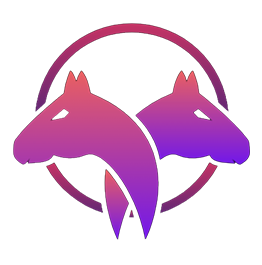

 

  

  <h3 align="center">eguap versão 0.1.2</h3>

  

    Uma linguagem de programação simples e moderna para aprender a programar.
     
    <a href="https://egua.tech/docs"><strong>Documentação »</strong></a>
     
     
    <a href="https://egua.tech/eguap/">IDE Online</a>
    ·
    <a href="https://github.com/eguatech/eguap/issues">Reportar Bug</a>
    ·
    <a href="https://github.com/eguatech/eguap/issues">Solicitar Funcionalidade</a>
     
     
    
    
    
    
     
  

